<!-- README.md is generated from README.Rmd. Please edit that file -->

# Analysis of T-cell multiomics (scRNA+scTCR) in Checkpoint Inhibitor-induced Colitis

## Introduction

A growing field of interest in immunology and is the study of T cell
subtype heterogeneity and T-cell receptor (TCR) diversity. This is of
particular interest in immuno-oncology, where a deep understanding of
T-cell and TCR diversity is essential to understanding the tumor
microenvironment and, importantly, for developing [new cancer
therapies](https://jhoonline.biomedcentral.com/articles/10.1186/s13045-021-01115-0).

Recent advances in 5’ single-cell sequencing, such as 10X Genomics
[Chromium Immune
Profiling](https://www.10xgenomics.com/products/single-cell-immune-profiling),
enables simultaneous profiling of gene expression and TCR
[V(D)J](https://en.wikipedia.org/wiki/V(D)J_recombination) sequences.

Here, we reanalyze a mutliomic scRNA+scTCR dataset from [Luoma et
al.](https://www.cell.com/cell/fulltext/S0092-8674(20)30688-7?_returnURL=https%3A%2F%2Flinkinghub.elsevier.com%2Fretrieve%2Fpii%2FS0092867420306887%3Fshowall%3Dtrue).
In this manuscript, they investigate immune cell behavior in the colon
during CTLA-4 and PD-1/PD-L1 checkpoint inhibitor (CPI) treatment. This
is of particular importance because 60% of patients treated with these
checkpoint blockades experience severe treatment-limiting toxicities –
particularly in the gastrointestinal mucosa. 10-20% of patients treated
with CTLA-4 checkpoint inhibitors experience severe, and potentially
life-threatening, colon inflammation (a.k.a. colitis).

## Dataset Overview

This dataset contains colon biopsies from n = 8 melanoma patients with
colitis, n = 6 melanoma patients without colitis, and n = 8 healthy
adults who underwent screening colonoscopies. Of the 6 melanoma patients
without colitis, 3 had enteritis (inflammation of the small intestine)
and 3 did not.

Following biopsy, the colon tissue was enzymatically digested, FACS
sorted into a CD3+ T-cell population, and then sequenced with 10X
Genomics 5’ single-cell immune profiling. For 16 of the patients, a
CD45+ mononuclear cell population was also sorted and sequenced.

The UMAPs below give some basic information regarding the dataset.

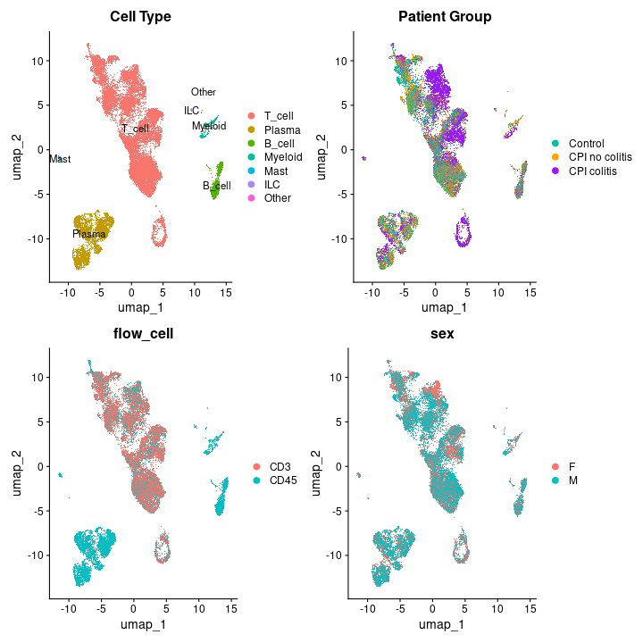

While looking at only the CD45+ separated cells, we see that CPI+
colitis (C) patients have a higher proportion of T-cells than both
control (CT) and CPI+ non-colitis (NC) patients.

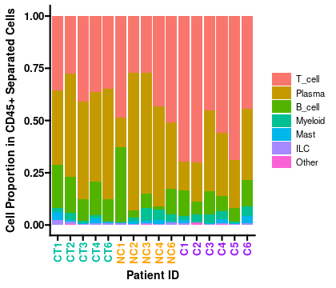

Additionally, we can see that there are large differences between
treatment groups within different celltypes.

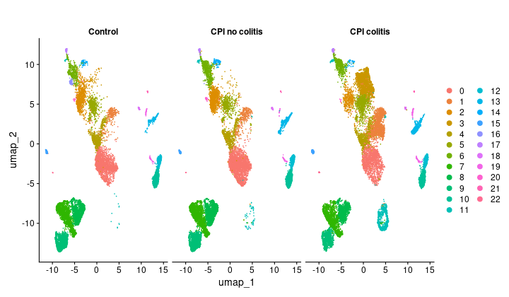

## T-cell subclustering

### T-cell overview

Next, we investigate the T-cells in greater detail. We see that the
T-cells generally separate into CD8 and CD4 subtypes. However, it isn’t
perfect – there are some clusters (e.g. cluster 10) which contain both
CD4 & CD8 cells, and there are some clusters which contain neither CD4
or CD8 cells (e.g. cluster 18), or contain only very low expression of a
marker gene (e.g. cluster 13).

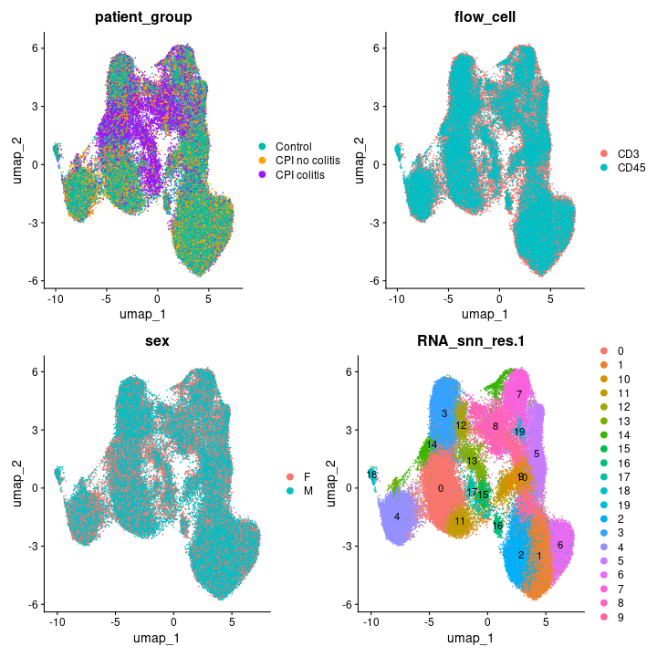

To remedy this, we instead use
[Azimuth](https://www.cell.com/cell/fulltext/S0092-8674(21)00583-3) to
annotate the cell types. We found that this worked very well for the
initial labeling of CD4/CD8/other T-cell subtypes, but did a poor job of
capturing heterogeneity in sub-subtypes. So, we next separated the CD4
and CD8 T-cells based on the Azimuth level 1 annotation, and studied
them separately.

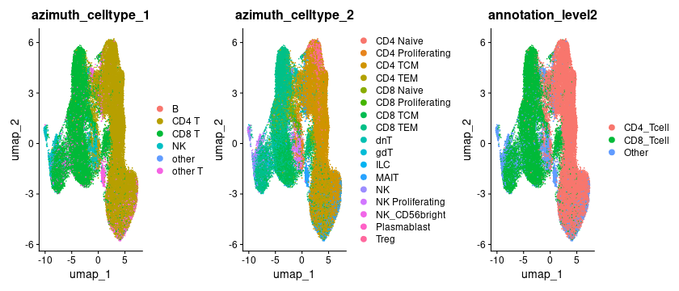

We can see that the proportion of CD4+ to CD8+ is relatively consistent
between the treatment groups.

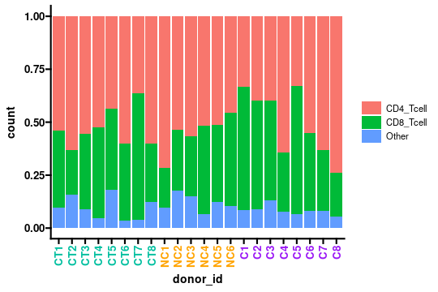

### CD8+ T-cell subclustering

First, we analyze the CD8+ Tcells. We see distinct clusters based on
known celltype markers, and we see a large difference in cell-type
proportions of CPI colitis patients compared to both controls and CPI
without colitis. In particular, we see a large increase in the cycling
and cytotoxic effector cells in CPI colitis, and a loss of Trm IEL and
Trm LP1 cells.

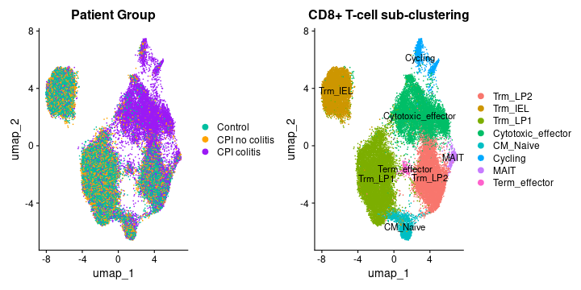
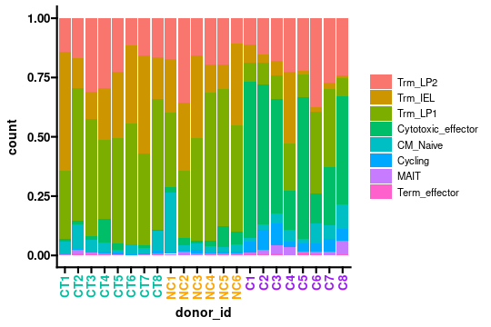
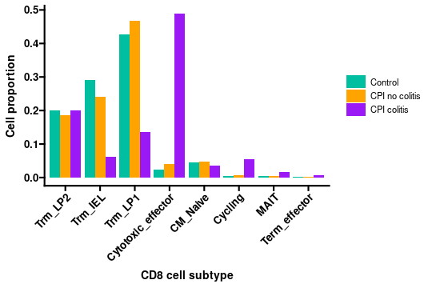

### CD4+ T-cell subclustering

Next, we analyze the CD4+ T-cells. We see distinct clusters based on
known celltype markers, and we again see a large difference in cell-type
proportions of CPI colitis patients compared to both controls and CPI
without colitis. In particular, we see a notable decrease in the
proportion of Tissue Resident Memory cells (Trm) and a large increase in
the proportion of Th1 effector cells, cycling cells, and regulatory
T-cells.

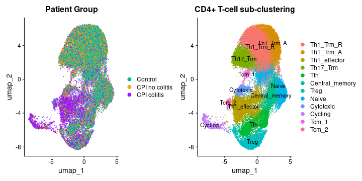
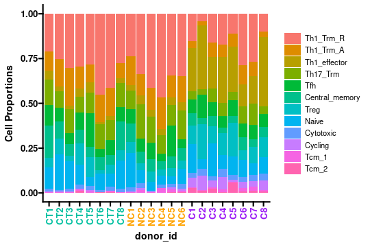
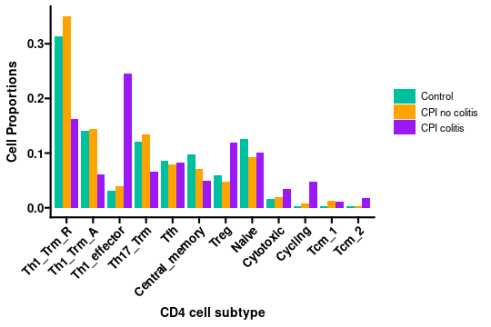

## T-cell checkpoint gene expression

We next investigated the expression of immune checkpoint genes and
inhibitory receptors in T-cell subclusters. We see that there is an
increased expression of checkpoint-related genes in both CD8 and CD4
T-cells.

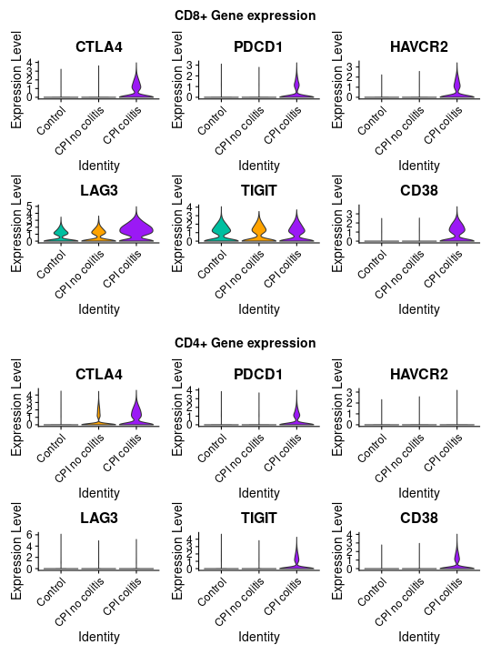

We can see from density plots that colitis-enriched celltypes are
sources of expression for these genes.

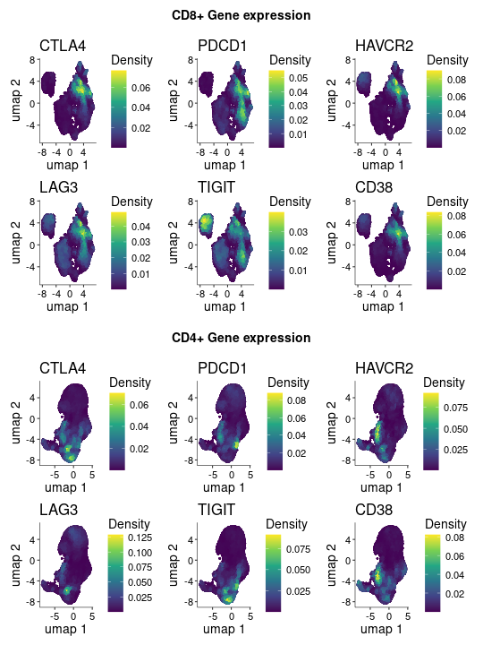

However, in a pseudobulk comparison of colitis vs non-colitis + control
samples, we see that CTLA4, HAVCR2, LAG3, and CD38 are significantly
upregulated in colitis CD8+ T-cells, but only HAVCR2 and CD38 are
upregulated in colitis CD4+ T-cells.

Our pseudobulk analysis also reveals that the colitis results in similar
changes in gene expression between CD4+ and CD8+ T-cells.

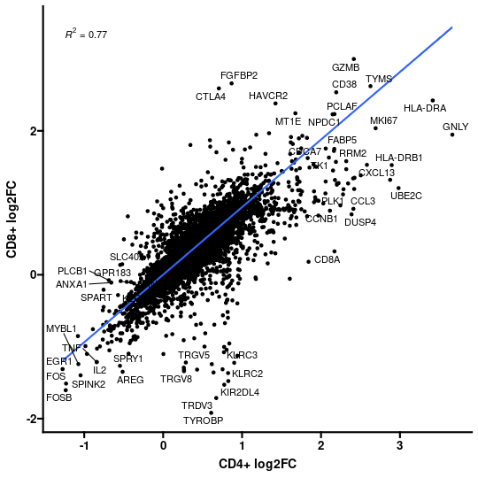

## T-cell Repetoire Analysis

Now we will turn our attention to the TCR data. Initial analysis of the
TCR data reveals that CD4+ cells have a higher number of unique
clonotypes, but have a much lower ratio of expanded clonotypes than CD8+
T-cells.

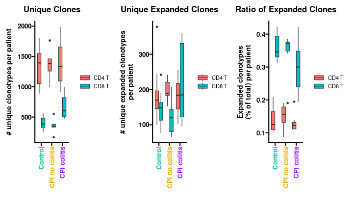

When looking at the number of expanded clonotypes per subcluster, we can
see that colitis-enriched celltypes have the highest humber of expanded
clonotypes. This is especially prominent in the CD8+ cytotoxic effector
cells.

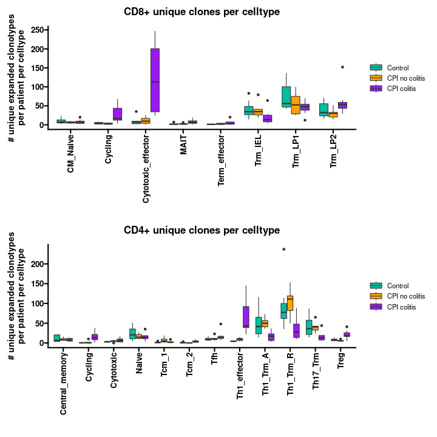

We next wanted to investigate the origin of this colitis-associated CD8+
cytotoxic effector celltype. To do this, we investigated overlap of
clonotypes between CD8+ clusters. We see the strongest overlaps between
this cluster and the Trm_LP1 & Trm_LP2 clusters, suggesting these
clusters are the likely origin for the cytotoxic effector cells.

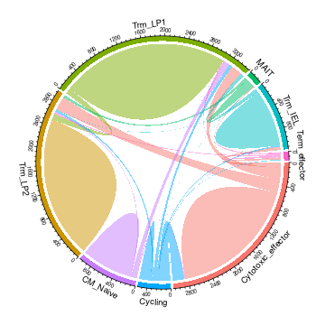
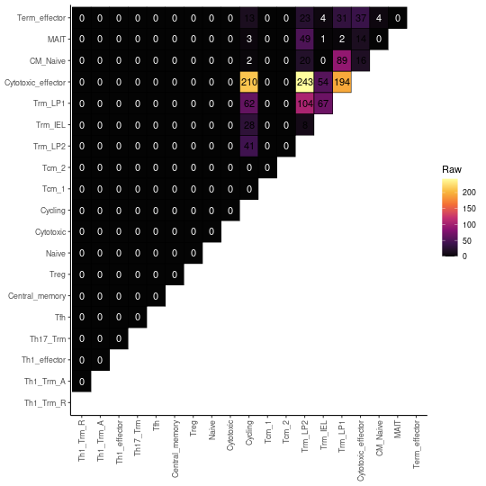

Finally, we confirm this by visualizing the location of the top 20 most
expanded clonotype amino acids in the cytotoxic effector cells.

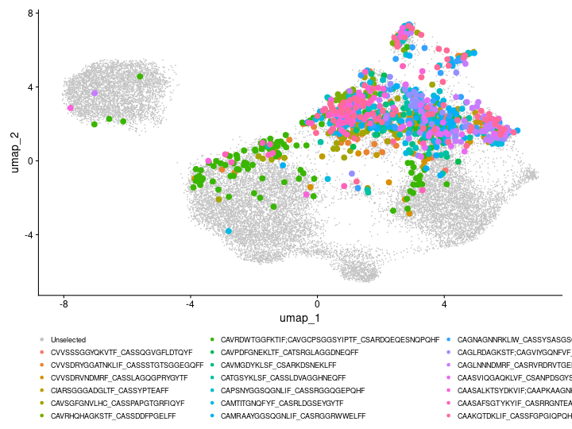

## Next steps

For further analysis of this dataset, the next step would be to cluster
the other (non-Tcell) celltypes, and then look at the interactions
between different celltypes. This was done to an extent with myeloid
cells in the original manuscript, but the authors did not dive into the
large B-cell and Plasma cell clusters. Additionally, utilizing a
more-advanced cell-cell communication method like
[cellchat](https://github.com/jinworks/CellChat) could provide
additional insights and potential therapeutic targets.
